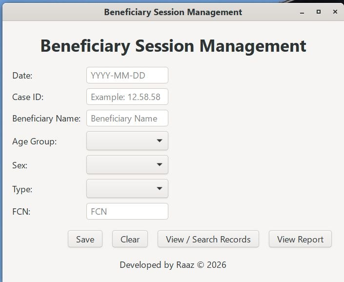
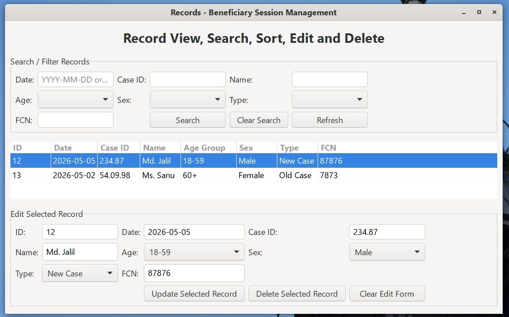
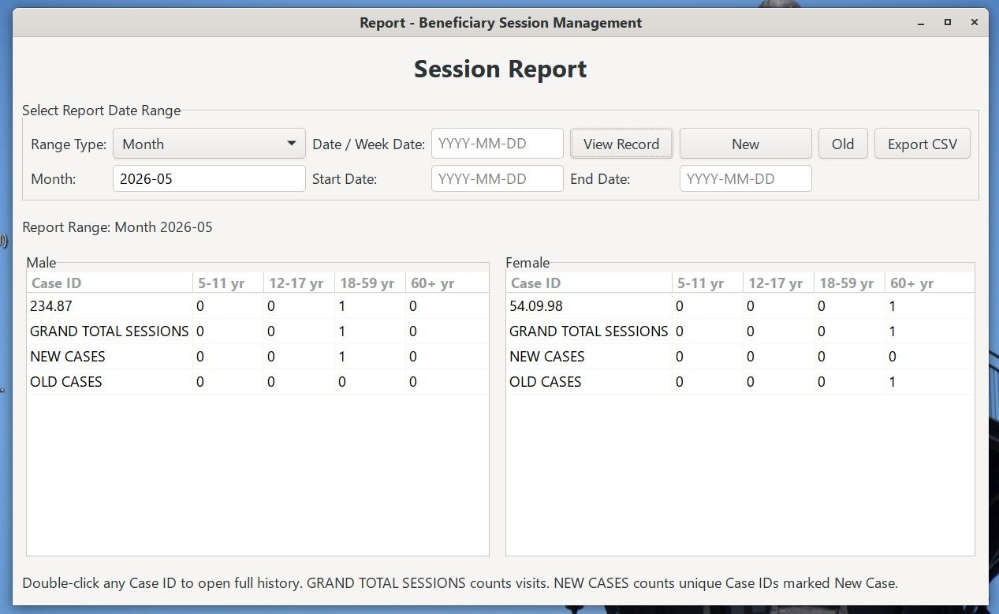
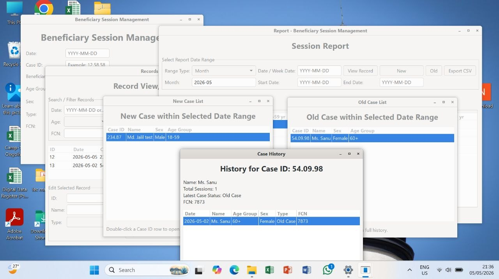

# Beneficiary Session Management

Cross-platform C-based GTK application for managing beneficiary session data using SQLite. Includes Windows installer packaging with MXE and Inno Setup.

---

## ✨ Features

- Add, update, delete beneficiary session records
- SQLite-based persistent storage
- CSV export functionality
- GTK-based GUI
- Windows installer (.exe) support
- Proper data storage in ProgramData (Windows)

---

## 🖥️ Screenshots

### Main Interface

### Edit, Update, Delete, View Record

### Report View / CSV Export

### All interfaces

---

## ⚙️ Build Instructions (Linux)

make
./build/app

🪟 Build Windows Version

make -f Makefile.win

📦 Create Windows Installer

Uses:

MXE (cross compiler)
Inno Setup (via Wine)

📁 Project Structure
src/        -> Source code
data/       -> Sample database
package/    -> Installer script
Makefile    -> Linux build
Makefile.win-> Windows build

👨‍💻 Developer
Rabbi_Nur_Raaz © 2026